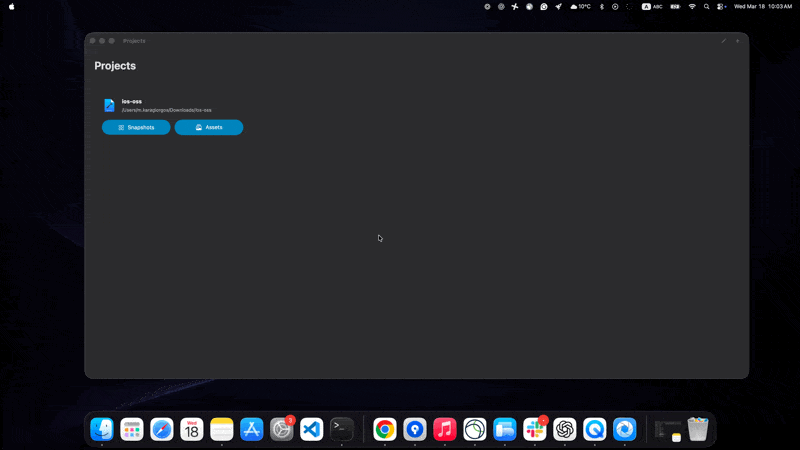

# 🚀 Bring Visibility to Your Xcode Assets

Xcode knows your assets.  
**NSAssets helps you see them.**

Explore, analyze, and understand your **xcassets** and **snapshot tests** with a clean, visual, Storybook-like experience for iOS & macOS.

---

## 🎬 Demo

---

## ✨ What You Can Do

### 🖼️ Browse XCAssets Visually
- Navigate all your asset catalogs in one place
- Instantly preview images without digging through folders
- Understand how your design system evolves

### 📸 Inspect Snapshot Tests
- View all snapshots across your app like a Storybook
- Quickly identify visual regressions
- Stop hunting through Xcode folders

### 📊 Track Asset Size & Impact
- Understand how much space your assets consume
- Detect heavy resources early
- Make better optimization decisions

### ⚡ Improve Your Workflow
- No more Finder digging or DerivedData pain
- Focus on UI quality instead of file hunting
- Built for developers who care about details

---

## 🧠 Why NSAssets?

Xcode gives you the data —  
but not the **visibility**.

NSAssets fills that gap with:
- A visual layer on top of your assets
- Faster feedback loops for UI development
- A developer experience similar to Storybook (but for native apps)

---

## 🔗 Resources

- 🌐 Website: https://nsbuilder.app  
- 📚 Documentation: (coming soon)  
- 💡 Feature Requests: Open an issue in the repository  

---

## ⬇️ Download

Available on the Mac App Store:

---

## ❓ FAQ

### Is NSAssets free?
Yes — core features are free.  
Advanced insights and productivity features will be available as premium.

### Can I use it with any project?
Yes — NSAssets works with standard Xcode projects using xcassets and snapshot testing.

### Does it replace Xcode?
No — it complements Xcode by giving you visibility and insights it doesn’t provide.

---

## 👨‍💻 Built for Developers

NSAssets is designed for iOS & macOS engineers who:
- Care about UI quality
- Use snapshot testing
- Want better tooling than what Xcode provides out of the box

---

## 💬 Feedback

Have an idea or found a bug?  
Open an issue — your feedback directly shapes the product.